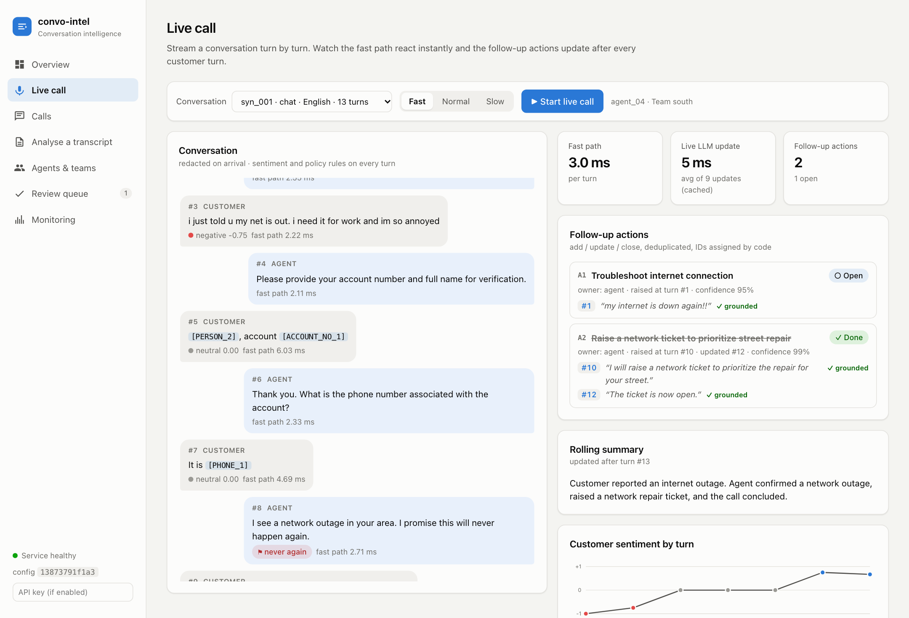

# convo-intel: call-center conversation intelligence

A small, production-minded microservice that analyses **every** telecom support conversation,
live and after the call:

* **Analysis**: concise summary, multi-label call reasons, customer sentiment trajectory
  (start → end, shift turns), resolution status, churn-risk flag + score.
* **Live follow-up actions**: updated as the conversation flows (every customer turn, plus
  agent turns that sound like a commitment), with an add / update / close lifecycle.
* **QA scoring** against a YAML checklist (greeting, identity verification, empathy, correct
  disclosure, no prohibited promises, proper closure): **quoted evidence for every score**,
  compliance violations, roll-ups to agent and team.
* **Explainability and reliability**: evidence-first prompts, a grounding validator that checks
  every quote, abstain options, a human-review queue, an online LLM judge on a sample of calls,
  PII redaction before any LLM call, model fallback chain, and an audit trail of prompt, model and
  config versions.

> Architecture: [docs/architecture.png](docs/architecture.png) + sequence diagram for one live turn in [docs/architecture.md](docs/architecture.md) · Revised build plan and
> the 15 risks fixed: [docs/PLAN.md](docs/PLAN.md) · Eval report: [docs/eval_report.md](docs/eval_report.md)

---

## 1. Problem background

Contact-center QA today is **manual sampling**: a QA analyst listens to roughly 1-2% of calls and
scores them against a checklist. That leaves three blind spots:

1. **Compliance risk is invisible at scale.** A prohibited promise ("I guarantee a full refund"),
   a skipped identity check, or a missing cancellation-fee disclosure in the other 98% of calls is
   never seen. In telecom these are regulatory and fraud risks (SIM-swap fraud starts with weak
   identity verification).
2. **Coaching is anecdotal.** With five reviewed calls per agent per month, scores are noise, and
   supervisors can't see *which* behaviour to coach.
3. **No "why" for the business.** Leaders can't see why customers call (billing vs network vs
   plan changes), which calls end unresolved, or who is about to churn, while it's still actionable.

What this service moves:

| Metric | How |
|---|---|
| **Compliance rate** | 100% of calls checked; critical failures become violations with evidence, reviewed by humans |
| **First-call resolution (FCR)** | resolution status per call + reasons show which issue types don't get resolved |
| **AHT (average handle time)** | live follow-up actions + rolling summary reduce after-call work (wrap-up notes) |
| **CSAT / churn** | sentiment trajectory + churn flag with evidence trigger a retention follow-up the same day |
| **QA cost** | analysts review only the flagged and unverified items instead of random samples |

## 2. Quick start

Requirements: Docker. A Gemini API key for anything that calls the LLM.
[uv](https://docs.astral.sh/uv/) only for running tests/evals on the host.

```bash
cp .env.example .env            # add GEMINI_API_KEY (free key works); check model names in AI Studio
make up                         # db, redis, api, worker  (http://localhost:8000, API docs at /docs)

make demo                       # instant, no key: restore the already-analysed 84 calls (vault excluded)
#   or
make seed                       # full pipeline: 69 synthetic + 15 real corpus calls through the API (~30 min on a free key)

open http://localhost:8000/ui   # dashboard (see below)
open http://localhost:9090      # Prometheus: scrapes api + worker, Alerts tab shows the 8 rules
```

**Dashboard** (`/ui`): *Overview* (coverage, QA, violations, churn, reasons, teams) · *Live call* (stream a
conversation turn by turn: fast-path flags, live follow-up actions, rolling summary, then the end-of-call result) ·
*Calls* (every verdict with its rationale and quoted turns) · *Analyse a transcript* (paste → analysis) ·
*Agents & teams* · *Review queue* · *Monitoring*.
Live replays and pasted transcripts are stored as demo runs: kept out of roll-ups and the Calls list (toggle 'Show demo runs').

**Without an API key** everything except brand-new text works: the LLM response cache is committed
(`data/cache`), so `make demo`, `make eval`, the regression gate and the live replay of `syn_001`–`syn_015`
and `syn_051`–`syn_065` all run offline. *Analyse a transcript* and other calls need `GEMINI_API_KEY`.



Optional: set `API_KEY` in `.env` to require `X-API-Key` on REST and `?api_key=` on the WebSocket
(the dashboard has a key field). Per-client config: send `tenant_id` (example tenant: `acme_telecom`,
whose checklist adds a call-recording-disclosure item).

Other commands (`make help`):

| Command | What it does |
|---|---|
| `make demo` / `make seed` | load analysed demo data instantly / run the real pipeline on all demo calls |
| `make reanalyze` | re-score every stored call after a prompt or config change |
| `make test` | 44 unit tests: normalizer, PII, grounding, rules, action lifecycle, QA scoring math, LLM retry/fallback/cache. No network. |
| `make eval` / `make eval-heldout` | evals vs the answer key → `docs/eval_dev.md`, `evals/results/` (from the committed cache: no key, ~1 s) |
| `uv run pytest evals/test_regression.py` | fails if the latest eval dropped below `evals/baseline.json` |
| `make replay` | stream a synthetic call over the live WebSocket from the terminal |
| `make synth` | regenerate synthetic calls + labels (Gemma 4 writes, code verifies) |
| `make fetch-corpus` | download a 25-conversation sample of the HF telecom corpus (range request, not 715 MB) |
| `make dashboard` | rebuild the React dashboard into `dashboard/dist` |

## 3. API examples

```bash
# Upload a transcript (voice) and analyse synchronously
curl -s -X POST localhost:8000/calls -H 'Content-Type: application/json' -d '{
  "agent_id": "agent_01", "team_id": "team_north", "analyze": "sync",
  "transcript": "Agent: Thank you for calling Nimbus Telecom, this is Ravi.\nCustomer: My bill is 400 rupees too high, I am fed up. My account is 55821934.\nAgent: Sorry about that. I guarantee you a full refund today.\nCustomer: Fine, but next time I am switching to another provider.\nAgent: I will raise the refund request now. Anything else? Have a good day."
}' | jq '.analysis.qa.violations'

# Chat log
curl -s -X POST localhost:8000/calls -H 'Content-Type: application/json' -d '{
  "agent_id": "agent_02", "team_id": "team_north", "channel": "chat",
  "messages": [{"sender": "user", "message": "hi", "timestamp": "2026-10-04T10:00:00Z"},
               {"sender": "user", "message": "my data is not working 😡", "timestamp": "2026-10-04T10:00:12Z"},
               {"sender": "agent", "message": "Hello! Sorry to hear that...", "timestamp": "2026-10-04T10:01:00Z"}]
}'

curl -s localhost:8000/calls/<call_id>           # turns (redacted), actions, analysis with evidence
curl -s localhost:8000/agents                    # agent roll-up (avg + shrunk QA, violation rate ...)
curl -s localhost:8000/teams/team_north          # team roll-up + its agents
curl -s localhost:8000/review                    # human review queue
curl -s -X POST localhost:8000/review/12 -H 'Content-Type: application/json' -d '{"status":"overturned","reviewer":"qa_lead"}'
curl -s localhost:8000/monitoring/drift          # call-reason mix vs baseline, with alerts
curl -s localhost:8000/monitoring/llm            # cost, tokens, p50/p95 latency per model/task
curl -s "localhost:8000/health?deep=true"        # db, redis, LLM reachable
curl -s localhost:8000/metrics                   # Prometheus
```

Live WebSocket protocol (`/ws/calls/{call_id}?agent_id=..&team_id=..`):

```text
→ {"type":"turn","turn_id":3,"speaker":"customer","text":"..."}
← {"type":"turn", "turn": {...redacted...}, "sentiment": {...}, "flags": [...], "latency_ms": 3.1, "duplicate": false}
← {"type":"actions", "changes": [{"op":"add","action_id":"A1",...}], "actions": [...], "summary": "...", "latency_ms": 1300}
→ {"type":"end"}
← {"type":"ended"} … {"type":"analysis", "summary": "...", "qa_score_pct": 81.0, "n_violations": 1}
```

## 4. How it works

```
turn ─► normalize ─► PII redact ─┬─► fast path (every turn, ms): sentiment + policy regex ─► push
                                 ├─► live LLM path (customer turns + agent commitments, p50 ~1.6 s):
                                 │     serial per call, coalescing → action deltas + rolling summary ─► push
                                 └─► end of call → arq worker → strong model: summary/reasons/resolution/churn
                                        + QA checklist → grounding validator → code scoring → Postgres → SQL roll-ups
```

| Module | Responsibility |
|---|---|
| [app/pipeline/normalize.py](app/pipeline/normalize.py) | transcript / chat / corpus → `Turn(turn_id, speaker, text, ts)`; merges chat bursts |
| [app/pipeline/pii.py](app/pipeline/pii.py) | `PIIBackend` interface (regex, GLiNER, hybrid) + shared placeholder logic |
| [app/pipeline/fast_path.py](app/pipeline/fast_path.py) | sentiment scorer interface (lexicon, RoBERTa), policy rule engine, trajectory |
| [app/pipeline/live_actions.py](app/pipeline/live_actions.py) | `ActionTracker` (lifecycle state machine) + `LiveSession` (ordered, coalescing) |
| [app/pipeline/final_analysis.py](app/pipeline/final_analysis.py) | summary, reasons, resolution, churn (strong model) |
| [app/pipeline/qa_scoring.py](app/pipeline/qa_scoring.py) | checklist verdicts → code computes score + violations |
| [app/pipeline/grounding.py](app/pipeline/grounding.py) | quote validator + one re-grounding retry |
| [app/pipeline/judge.py](app/pipeline/judge.py) | online LLM judge (blind) on a sample of finished analyses |
| [app/llm.py](app/llm.py) | the only Gemini caller: cache, limiter, backoff, schema retry, fallback chain, cost |
| [app/prompts.py](app/prompts.py) | versioned prompts |
| [app/db/schema.sql](app/db/schema.sql) | tables + roll-up views; `pii_vault` schema |
| [app/api/](app/api/) · [app/worker.py](app/worker.py) | REST + WebSocket + optional API-key auth · arq jobs (analysis, judge sample) + PII purge cron |
| [config/](config/) | `qa_checklist.yaml`, `taxonomy.yaml`, `policy.yaml`, `models.yaml` |

## 5. Design decisions

**Evidence first, code decides.** Every LLM schema puts `evidence: [{turn_id, quote}]` *before*
the verdict, so the model commits to quotes first. The grounding validator then checks each
quote is really in the cited turn (case, punctuation and `...` tolerant, word-exact). Failures
get one targeted retry ("these quotes were not found: ..."). Anything still unverified is kept
but marked `verified=false`, **excluded from the QA score**, and sent to the review queue.
"N/A" and "insufficient_evidence" are first-class verdicts; N/A is only accepted where the YAML
allows it.

**Absence evidence.** "No evidence = no score" breaks for things that *didn't* happen (no
greeting). Each checklist item says which turn to cite in that case (the agent's first turn,
the last agent turn ...), so absence verdicts are still grounded.

**LLMs don't do arithmetic here.** The weighted QA %, violations (failed `critical` items), and
the sentiment trajectory are computed in code from per-item / per-turn outputs, so they are
consistent and auditable.

**Two detectors for prohibited promises.** Regex rules from `policy.yaml` run instantly on every
agent turn (exact evidence by construction, catches the literal phrases), and the LLM QA item
catches paraphrases. Violations are the union, tagged `rule`, `llm` or `rule+llm`; disagreements
go to review. The eval shows each detector's recall separately.

**Fast path vs LLM path.** Running an LLM on every turn of every call would be the main cost and
latency driver and a single point of failure. The fast path (lexicon sentiment + regex) is free,
~3 ms per turn including the DB write (0.09 ms of compute) and always on. The live LLM only handles what needs language understanding (actions,
summary) and uses the cheapest model. The careful work runs once per call.

**Live actions: ordered + coalescing.** Deltas depend on the previous action list, so one
consumer per call processes turns in order (a generic job queue could reorder them). If the
model is slower than the conversation, all waiting turns go in one call: every turn is still
covered, cost stays bounded, and latency doesn't snowball (the backpressure mechanism).
Idempotency: code (not the LLM) assigns action IDs; an `add` similar to an open action becomes an
`update`; `close` on a closed action is a no-op; unknown IDs are rejected; turns have a
`(call_id, turn_id)` primary key so re-sent turns are ignored.

**PII.** Typed placeholders (`[PHONE_1]`, `[ACCOUNT_NO_1]`, `[CARD_NUMBER_1]`) keep the meaning
for QA ("customer gave [ACCOUNT_NO_1]" ⇒ identity verification happened) without the value. The
same value always gets the same placeholder within a call, even across a reconnect (context is
rebuilt from the vault). Spoken digits ("four one one one ...", "double five") are caught,
which matters for card numbers read aloud (PCI-DSS).

**Why arq (and not Redis Streams / Kafka).** arq is a small asyncio job queue on Redis (sorted
set + keys, *not* Streams): retries, job-id dedup, cron, results, about 30 lines of config.
End-of-call analysis is a classic "job" workload. At much higher volume, or when several consumers
need the same event stream (analytics, CRM sync), I'd move turn events to Redis Streams consumer
groups or Kafka partitioned by `call_id` (which preserves per-call order across many workers).

**Postgres + raw SQL.** Roll-ups are SQL views, so the numbers in the dashboard are one `SELECT`
away from audit. asyncpg with plain SQL instead of an ORM: every query is visible in
[app/db/repo.py](app/db/repo.py).

**Langfuse is optional.** Self-hosting Langfuse v3 means ClickHouse + Redis + S3. The `llm_calls`
table (task, model, prompt version, tokens, latency, cost, status, error) + Prometheus covers
the same audit and cost story for this scope.

**Configurable without code.** New QA item for a client: add it to `qa_checklist.yaml` with a
description, weight, `critical`, `allow_na` / `na_when` and `absence_evidence`. The prompt is
rendered from the YAML, the scorer reads weights from it, the config hash changes automatically
(stored on every analysis), and `POST /calls/{id}/analyze` re-scores old calls.

## 6. Evals and system health

See **[docs/eval_report.md](docs/eval_report.md)** for the full tables.

**Data.** 69 synthetic calls with planted, code-verified outcomes (49 **dev** for tuning, 20
**held-out**, never tuned on), plus 15 real conversations from the HF telecom corpus (no labels,
used as a sanity check). 20 are chat logs, 9 are Hinglish. Planted: 63 QA failures, 28 churn calls,
261 PII values (including 10 card numbers read aloud).

| Metric | Dev | **Held-out** |
|---|---|---|
| QA item accuracy (6 items) | 99.3% | **99.2%** |
| Compliance violations: recall / precision | 96.8% / 96.8% | **90.9% / 100%** |
| Call reasons: micro-F1 | 85.7% | **78.9%** (understated: planted reasons found 88/88, see Limitations) |
| Resolution status: accuracy | 65.3% | **75.0%** |
| Churn: recall (precision) | 76.2% (94.1%) | **71.4% (100%)** |
| Sentiment direction agreement (lexicon, no LLM) | 79.6% | **90.0%** |
| Live follow-up actions: recall (15 replayed calls each) | 94.1% | **100%** |
| PII recall, regex backend | 100% | **100%** (see caveat) |
| Evidence quotes that pass the grounding validator | 100% of 589 | **100% of 272** |

**Every call was answered by the configured model** (`gemini-3.5-flash-lite` for both tiers, no
fallbacks). Config `13873791f1a3`, prompts `final_analysis.v1`, `qa_scoring.v1`, `live_actions.v2`.

What the numbers say:

* **Grounding works.** All 861 evidence quotes were found verbatim in the cited turn; one
  re-grounding retry was needed in total.
* **Regex alone is not enough for compliance; the LLM is needed.** Regex caught 37.5% (dev) / 33%
  (held-out) of planted prohibited promises, because half are paraphrases by design ("trust me, the
  money will definitely be back by tomorrow"). The LLM caught 100%. Violations are the union.
* **The regression gate earned its keep.** Switching the QA model from `3.1-flash-lite` (fallback)
  to `3.5-flash-lite` dropped dev violation recall from 100% to 93.5% and **the gate failed**. The two
  new misses included a `partial` disclosure on a critical item, which the code didn't count as a
  violation. Policy change (`violation_verdicts: [fail, partial]` in the YAML): recall 96.8% with
  precision unchanged, checked on both splits before adopting it.
* **Error analysis fixed a policy bug.** The first dev run had identity-verification fail recall of
  43%: the agent asked for name + phone and my checklist counted that as verification. Name, phone and
  address are public (SIM-swap fraud), so the checklist now requires a knowledge factor: dev 85.7%,
  held-out 100% (5/5).
* **Weakest numbers.** (1) **Churn recall on held-out (71%)** and (2) **resolution status (65% dev / 75% held-out)**:
  almost all resolution errors are `partial → resolved` ("technician booked, not yet fixed"), a
  boundary that is fuzzy even for human labellers. Churn misses are customers who threaten indirectly.
  Both are prompt-definition problems; next step: examples in the prompt + a "fixed during the call?"
  sub-question. It is also the least *stable* output (see the audit fix below). (3) Held-out n=20: one call moves a
  metric by 5-10 points.
* Tried final_analysis.v2 (sharper resolution/churn rules): dev resolution 65.3%→49.0%, churn recall 76.2%→100% (precision 94.1%→100%); not adopted. The regression gate failed: the stricter "a booked visit is NOT resolved" rule pushed 19 resolved calls to partial, so the churn rule alone is the next thing to try.
* **PII caveat.** Regex recall improved from 90% to 98.9% during the build (per-call name memory,
  vocative names: "Thanks, Emily.") and to 100% after the audit fixes below. I designed some patterns after
  looking at leaks that **included held-out calls**, so the held-out PII number is not untouched, and these are
  planted values only: real calls will have names without any cue. The hybrid backend is 100%.
* **Hinglish** (9 calls: 8 dev, only 1 held-out): QA accuracy 100%, violation recall 100%, PII recall 100%.
  No drop at this sample size, but n is too small to claim parity, and these are effectively dev numbers.
* **Reproducible.** `make eval` re-runs both splits from the committed LLM cache in about a second and gives
  exactly these numbers; CI does the same before the regression gate, so a code change that alters what the
  pipeline sends or scores fails the build.
* **Audit fixes (5 Oct) and what they revealed.** Two name bugs found in a dry run: greeting words before a name
  ("Hey Lucy,", "Good morning Ravi,") created a second placeholder or leaked the name, and a title ("Thank you,
  Mr. Mehta.") was redacted *instead of* the surname, which leaked. Fixed with tests; dev PII recall 98.4% → 100%.
  The title fix changed only names in 32 calls, yet **4 resolution answers flipped**, all at the `partial`
  boundary (3 became wrong on dev, 1 became right on held-out): dev resolution 71.4% → 65.3%, held-out 70% → 75%.
  **The regression gate failed, as designed.** I kept the privacy fix, checked each flipped call, and re-set the
  baseline on purpose. Lesson: a semantically irrelevant input change should not move an output; resolution
  needs a sharper definition (and, in production, a self-consistency check) before it is trusted.

**System health (measured).** Fast path: **0.09 ms per turn** (redaction + sentiment + rules).
Live action update on `gemini-3.5-flash-lite`: **p50 1.6 s, p95 2.2 s** (228 updates, inside the 4 s
budget). With the fallback `gemini-3.1-flash-lite` it was p50 7.0 s / p95 12.9 s, which is why the live
path now has a time budget and its own fallback chain. End-of-call: final analysis p50 ~2.7 s and QA
p50 ~2.9 s, run in parallel. Cost: ≈ **$0.002 per call** with a live update on every customer turn (measured tokens × assumed prices; see the cost math in §8).
Blind LLM judge on held-out: 93% agreement, flags 7 of 10 real errors, 2.7% false alarms (exploration 4).
Regression gate: `evals/test_regression.py` passes (10 checks) against `evals/baseline.json`.

## 7. Additional exploration

Full tables: [docs/eval_report.md](docs/eval_report.md). Commands: `evals/experiments.py pii | sentiment | qa_model`, `evals/judge_agreement.py judge.v1|judge.v2|judge.v3`.

**1. PII: regex vs GLiNER vs hybrid** (all 69 calls, 261 planted values)

| Backend | Recall | Leaked | False positives / call | ms / turn |
|---|---|---|---|---|
| regex (default) | **98.9%** (100% after the 5 Oct fixes) | 3 | 0.6 | 0.04 |
| GLiNER, raw | 89.7% | 27 | 14.7 | 62 |
| GLiNER + plausibility filter | 89.7% | 27 | 0.8 | 63 |
| **hybrid (regex ∪ GLiNER)** | **100%** | **0** | 0.8 | 62 |

The two backends fail in opposite places. Regex is perfect on structured values (phones, account
numbers, spoken card digits) but misses names said without a cue. GLiNER finds every name but **0%
of card numbers read aloud** and 77% of account numbers, and raw GLiNER tagged the pronouns "I" and
"you" as PERSON 280+ times (a plausibility filter removes these with no recall loss). Building this
also improved regex from 90.4% to 98.9% (per-call name memory: after "my name is James Wilson", a
later "Thanks, James" gets the same placeholder; and vocative names like "these issues, Sneha."). Conclusion: **use hybrid in production** (a leak
is the costly error); regex stays the default only to keep the Docker image free of PyTorch.

**2. Sentiment: lexicon vs multilingual RoBERTa** (69 calls, start → end direction)

| Scorer | Direction agreement | Hinglish (9) | ms / turn |
|---|---|---|---|
| lexicon (default) | 82.6% | 100% | 0.01 |
| twitter-xlm-roberta | 79.7% | 100% | 11.8 |

On these calls the free word-list scorer is as good as the transformer and ~1000× faster, which
supports the fast-path design. Caveat: synthetic customers state emotions explicitly ("I'm fed up"),
which favours a lexicon; on real ASR text with sarcasm I'd expect RoBERTa to win. The backend is one
env var (`SENTIMENT_BACKEND`).

**3. QA scoring: small vs larger (thinking) model** (14 dev calls answered by both)

| Model | QA item accuracy | Violation recall | Cost / call | Output tokens (p50) |
|---|---|---|---|---|
| `gemini-3.1-flash-lite` | 98.8% | 100% | $0.0004 | 684 |
| `gemini-3-flash-preview` (thinking) | 98.8% | 100% | $0.0133 | 3,968 |

On these calls the thinking model costs **~32× more for identical accuracy**: most of its output is
"thought" tokens. This justifies the tiered design: the default strong tier can be a flash-lite
model, and the thinking model stays one env var away (`GEMINI_MODEL_STRONG`) for the messier real
calls where it might pay off. Caveat: 14 clean synthetic calls; free-tier quota (20/day on thinking
models) capped the sample. An earlier 3-call run with `gemini-3.6-flash` showed the same pattern.

**4. LLM judge vs the answer key** (20 held-out calls; the online judge samples 5% of calls in production)

| Judge design | Agreement with system | Real system errors flagged | False alarms |
|---|---|---|---|
| v1 "verify": sees the system's verdict + quotes, asked "is it supported?" | 100% | **0 of 22** | 0 |
| v2 "blind": sees only transcript + definitions, gives its own answer; code compares | 91.2% | 6 of 8 (75%) | 8 of 152 (5.3%) |
| **v3 = v2 + the policy's disclosure / prohibited lists** | 93.1% | **7 of 10 (70%)** | **4 of 150 (2.7%)** |

(v1/v2 were measured on the earlier analyses, which used the QA fallback model; v3 on the final ones.)

The first judge rubber-stamped everything: shown the system's answer, the model anchored on it.
Making it **blind** (independent answer, disagreement computed in code) caught 6 of the 8 real
errors, e.g. a call marked `resolved` where the technician was only *booked* (`partial`). Auditing
v1's "misses" also showed most of them were label gaps, not system errors (see Limitations). Of the
8 false alarms, 5 were on `correct_disclosure` because v2's prompt lacked the policy's
required-disclosure list; v3 adds it and those false alarms disappear (4 left, all judgment calls,
e.g. whether an account number counts as a "secret"). Judge = Gemma 4 31B (a different model family
from the scorer); one call fell back to `gemini-3.1-flash-lite` (the fallback chain), which is noted
in the results. Conclusion: an LLM judge is only useful as a monitor if it is **blind**, and its
flags still go to humans, never straight into scores.

**5. Hinglish / code-mixed calls** (slices in the eval): on 9 Hinglish calls QA accuracy and
violation recall were 100% and PII recall 100% (English dev calls: also 100%). No measurable drop, but n=9.
What helped: Hinglish name cues in the PII regex ("main X bol rahi hoon", "mera naam"), Hinglish
words in the sentiment lexicon ("bekaar", "pareshan", "shukriya") and churn phrases ("dusre network",
"port karwa"), and a multilingual RoBERTa option.

## 8. Production scale considerations

**Horizontal scaling.** API pods are stateless apart from open WebSockets (sticky per call at the
load balancer); a reconnect to another pod resumes from Postgres (turns, actions, PII
placeholders are reloaded). Workers scale on `arq_queue_depth`. For 10k concurrent calls, turn
events would move to Kafka/Redis Streams partitioned by `call_id`, so live-action consumers can
scale out while keeping per-call order.

**Backpressure.** The fast path never waits on the LLM. The live path coalesces under load (fewer,
larger LLM calls). The end-of-call queue absorbs bursts; if it grows, analyses arrive later, not
never.

**Cost math** (token counts measured in the eval; prices in `config/models.yaml` are assumptions,
verify on the pricing page):

Measured on the synthetic set: 13.1 turns per call, 8.2 of which trigger a live update.
Measured tokens per LLM call: live update ≈ 890 in / 200 out (fast model, no thinking);
final analysis ≈ 950 in / 470 out and QA ≈ 1,350 in / 640 out on flash-lite; a thinking model
adds roughly 2-3k "thought" tokens per end-of-call task (billed as output).

| Design (per call) | LLM calls | Est. cost / call | Live latency |
|---|---|---|---|
| **This design, flash-lite everywhere** | 8.2 live + 2 end-of-call | **≈ $0.002** | ~1-2 s per update |
| **This design, thinking model for end-of-call** | 8.2 live + 2 end-of-call | **≈ $0.015** | ~1-2 s per update |
| Naive: thinking model on every turn, full transcript each time | ~13 | ≈ $0.04-0.08 | 5-15 s per turn |
| No live path at all (batch only) | 2-3 | ≈ $0.001-0.014 | none (fails the "live" requirement) |

At **10,000 concurrent calls** (≈ 6-minute calls ⇒ ~1,700 calls/minute ⇒ ~100k calls/hour;
say 800k calls/day): this design ≈ **$1.6k/day** (flash-lite) to **$12k/day** (thinking model at
end of call), vs **$32k+/day** for the naive per-turn strong model. The live path alone is about
**230 LLM requests/second** at that scale (10,000 × 8.2 updates ÷ 360 s): that needs provisioned throughput / a paid tier, and
coalescing keeps it bounded (under load, several turns share one request). The fast path costs
nothing per turn. These prices are the assumptions in `config/models.yaml`; the structure of the
comparison holds even if the prices move.

**Latency budget.** Fast path: ~2-6 ms per turn. Live action update: target < 2 s (measured
p50/p95 in the eval). End-of-call analysis: target < 30 s (it's off the critical path).

**Live latency budget.** Each live update has a 4 s budget (`LIVE_TIMEOUT_S`). A miss is cancelled
and its turns are carried into the next update (coalescing), and the budget doubles (max 4×) so a
consistently slow model still delivers, just later; it resets after a success. The fast tier has its
own fallback chain (`GEMINI_MODEL_FAST_FALLBACK`) so it can be restricted to low-latency models.

**Fallback models must match the latency class.** The fallback chain kept every analysis
correct when the primary's quota ran out, but `gemini-3.1-flash-lite` answered live updates in ~7 s
instead of ~1.5 s. In production the live path's fallback should be another low-latency model (or a
provisioned-throughput endpoint), and if none is available it is better to coalesce and *delay*
action updates than to block the call.

**Model fallback and rate limits.** Exponential backoff on 5xx/429-per-minute, immediate
fallback on daily-quota 429s, a chain of fallback models from a different family (separate
capacity pools), a client-side RPM limiter, and a disk cache. This was exercised for real during
the build: `gemini-2.5-flash` started returning 404 "no longer available to new users", the
primary returned bursts of 503, and the free tier allows 20 requests/day per model on
`gemini-3.5-flash`.

**Data privacy.** Redaction happens before storage, logs or any external call; what it misses
(names without a cue, on real calls; 0% of planted values with hybrid) would still reach the LLM provider,
so production should run the hybrid backend and a provider with a no-retention/DPA agreement. Raw values live
only in `pii_vault.entities` (separate schema, never joined by views or exposed by the API),
purged hourly after `PII_TTL_DAYS`. In production: a separate DB role with `REVOKE` for
app/analytics roles, encryption at rest, and audit logging on vault reads. Card numbers read
aloud fall under **PCI-DSS**: they must never reach storage unredacted (ideally the IVR pauses
recording during payment). Telecom regulators often require **data residency**: use a regional
LLM endpoint (Vertex AI region) or a self-hosted model; the provider is isolated in `app/llm.py`.

**Multi-tenancy.** Each call carries a `tenant_id`; `config/tenants/<tenant>/` can override any of
the three YAML files (the rest fall back to the base config). The tenant is validated (it becomes a
path), unknown tenants are rejected, and the tenant is part of the config hash stored with every
analysis. Example: `acme_telecom` adds a critical call-recording-disclosure item, with no code change.

**Versioning and reproducibility.** Every analysis stores model names, prompt versions
(`qa_scoring.v1` ...) and the config hash. LLM responses are cached by (task, prompt version,
model, input), so a score can be reproduced or diffed after a prompt change.

**Monitoring.** `/metrics`: per-turn latency (fast/live), LLM latency/tokens/cost/status per
model and task, grounding pass/fail, review-queue inflow by reason, pipeline errors, queue depth,
active live calls. SQL: reason drift (`/monitoring/drift`), human-review overturn rate
(`/monitoring/review`), daily cost and p50/p95 (`/monitoring/llm`), judge results (`/monitoring/judge`).
Alert rules ([ops/alerts.yml](ops/alerts.yml), loaded by the Prometheus container): live p95 > 3 s,
fast path p95 > 100 ms, fallback rate > 10%, LLM error rate > 20%, unverified quotes > 10%, median judge
score < 0.9, queue backlog > 200, pipeline stage failures. Reason drift (> 15 points) and reviewer overturn
rate (> 20%) are SQL checks on the endpoints above.

## 9. Limitations (honest list)

* **Free-tier run.** The Gemini free tier allows ~20 requests/day on "flash" (thinking) models and
  ~500/day on flash-lite, ~10 requests/minute. The reported numbers therefore use
  **`gemini-3.5-flash-lite` for both tiers**; the model-size experiment shows a thinking model gave the
  same accuracy at ~32× the cost on 14 calls. Switching is one env var (`GEMINI_MODEL_STRONG`).
* **Synthetic data is cleaner than real calls.** Gemma 4 writes fluent, well-structured dialogue;
  real calls have ASR errors, interruptions and cross-talk. Labels come from the Python spec (not the
  LLM) and are code-verified, but the "expected action turn" tags come from the generator.
  The real corpus calls (team_corpus) have no labels; they're a sanity check on real language only.
* **Labels list only the planted call reasons.** Python picks the scenario's reasons, then the generator writes
  natural side topics (a customer cancels *because of* signal drops), but the answer key keeps only Python's list.
  So a correctly detected secondary reason counts as a false positive. Measured: **every planted reason was found
  (60/60 dev, 28/28 held-out)**; all of the F1 loss is extra reasons the key does not list (20 dev, 15 held-out),
  and the ones checked by hand were really discussed. Fix: label secondary reasons by hand. (Found while auditing
  the LLM judge.)
* **Small samples.** 49 dev / 20 held-out calls, 9 Hinglish. A difference of one or two calls moves
  a metric by 5-10 points. These numbers are for direction, not certification.
* **Lexicon sentiment is crude** (no sarcasm, idioms or context; e.g. "my data *stopped working*,
  I'm fed up" scores 0.0 because "working" counts as positive). It exists because it is free and
  instant on every turn; RoBERTa is wired behind the same interface (`SENTIMENT_BACKEND=roberta`).
* **Default PII backend is regex** (100% of planted values after the audit fixes; names are still the weak spot,
  since real callers say names without a cue).
  The hybrid backend reached 100% but adds PyTorch (~1 GB) and ~60 ms per turn on CPU; in production
  I'd run hybrid (or GLiNER as a sidecar service).
* **Live sessions live in the API process.** A reconnect resumes from Postgres, but an API crash
  drops in-flight live updates for that call until the next turn.
* **`pii_vault` access control is demonstrative.** It is a separate schema, but the demo uses one
  DB role; production needs a separate role, encryption at rest and audited reads.
* **Not built (stretch):** Langfuse traces; Alertmanager routing (Prometheus evaluates the rules,
  but alerts are not sent anywhere); per-tenant API keys (one shared key today).

## 10. Repo layout

```
app/            api/ (REST + WebSocket), pipeline/ (the analysis), db/ (schema, views, repo), llm.py, prompts.py, worker.py
config/         qa_checklist.yaml, taxonomy.yaml, policy.yaml, models.yaml
data/           synth_generate.py, fetch_corpus.py, synthetic/calls/, labels/labels.jsonl, corpus_sample.json, cache/ (LLM responses)
evals/          run_evals.py, test_regression.py, experiments.py, baseline.json, results/
tests/          unit tests (no network)
dashboard/      React (Vite) → dist/ served at /ui (overview, live call, calls, analyse, agents & teams, review, monitoring)
scripts/        seed.py, live_replay.py
docs/           architecture.png (+ .html source), sequence_live_turn.png, architecture.md, PLAN.md, eval_report.md, dashboard_live.png
ops/            prometheus.yml (scrape config) + alerts.yml (8 alert rules)
.github/        CI: lint, unit tests, offline dev eval + regression gate, dashboard build
```
