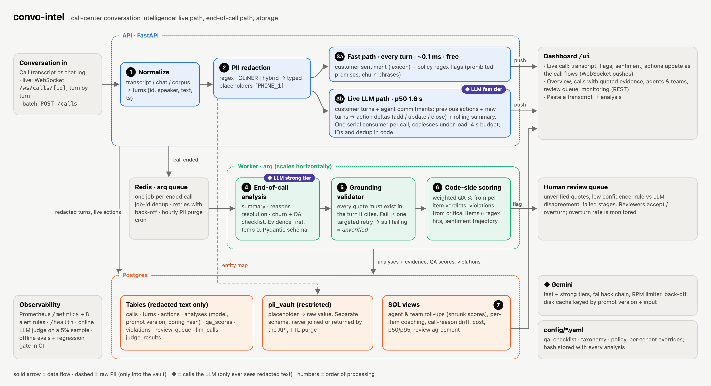
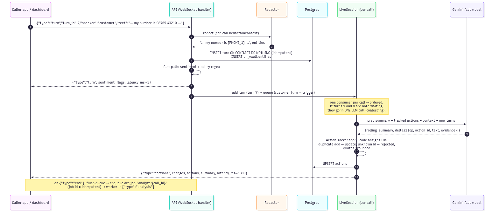
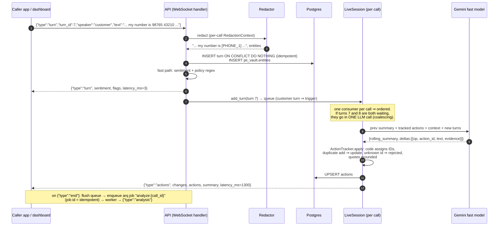

# Architecture

## System view

Source: [architecture.html](architecture.html) (open it in a browser; the PNG is a screenshot of it).
Numbers in the diagram are the processing order used throughout the README and the code.

Key properties:

* **Redaction runs before storage, logs or any LLM call**: detected PII is replaced by typed
  placeholders and only `pii_vault.entities` holds the values, with a TTL. Detection is not perfect:
  the default regex backend catches 100% of planted values in the current evals (98.9% in the PII
  experiment, before the last name fixes), but names said without a cue are its weak spot on real calls.
  The hybrid regex + GLiNER backend reached 100% in the experiment, which is why hybrid is the production recommendation.
* **Two latency classes.** The fast path answers every turn in milliseconds at zero cost.
  The live LLM path (customer turns plus agent commitments) updates actions in ~1-2 s, inside a 4 s budget (a miss is carried into the next update). The expensive, careful analysis happens once,
  at the end of the call, on the worker.
* **The LLM proposes, code decides.** The LLM returns verdicts with quotes. Code verifies quotes,
  enforces the N/A rules, computes scores and violations, and routes doubtful items to humans.

## Sequence: one live customer turn

Mermaid source

## Failure behaviour

| Failure | What happens |
|---|---|
| Gemini 5xx / timeout / per-minute 429 | retry same model with exponential backoff + jitter (2, 4, 8 s) |
| Daily quota 429, or repeated failures | next model in the fallback chain |
| Invalid JSON / schema mismatch | one retry with the validation error appended, then fallback |
| Quote not found in cited turn | one re-grounding retry with the exact failures listed; still failing ⇒ `verified=false` + review queue; excluded from the QA score |
| Live LLM unavailable | fast path keeps working; failed turns are carried into the next live batch; `live_error` event |
| End-of-call stage fails | partial analysis is saved + `analysis_failed` review item; arq retries the job (30 s, 60 s) |
| Same turn re-sent / reconnect | PK `(call_id, turn_id)` ignores duplicates; actions, turns and PII placeholders are reloaded |
| Duplicate "end" | arq job id `analyze:{call_id}` is only queued once |
